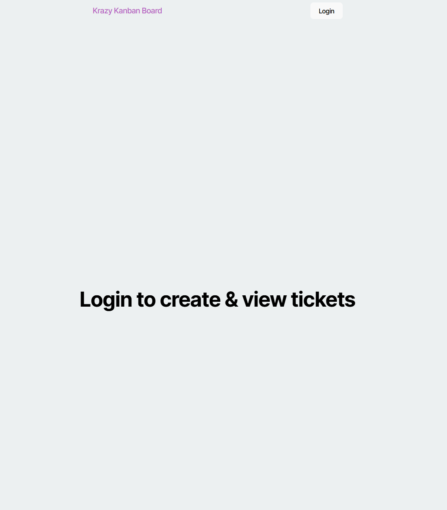
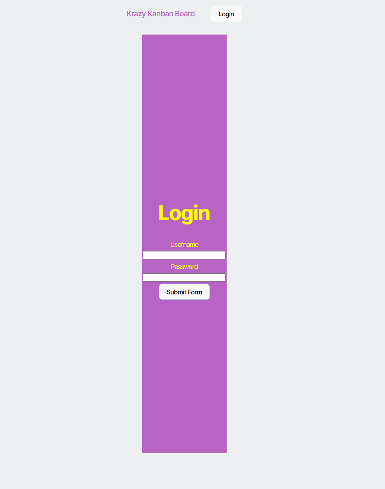
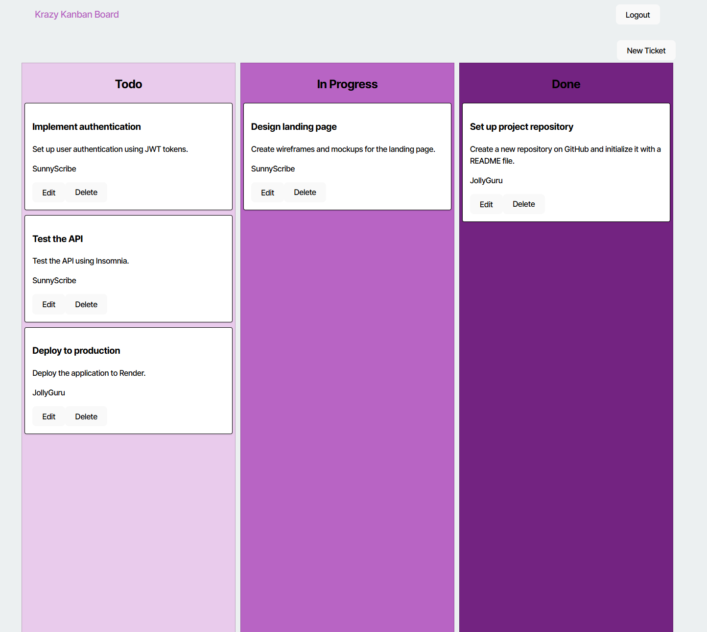
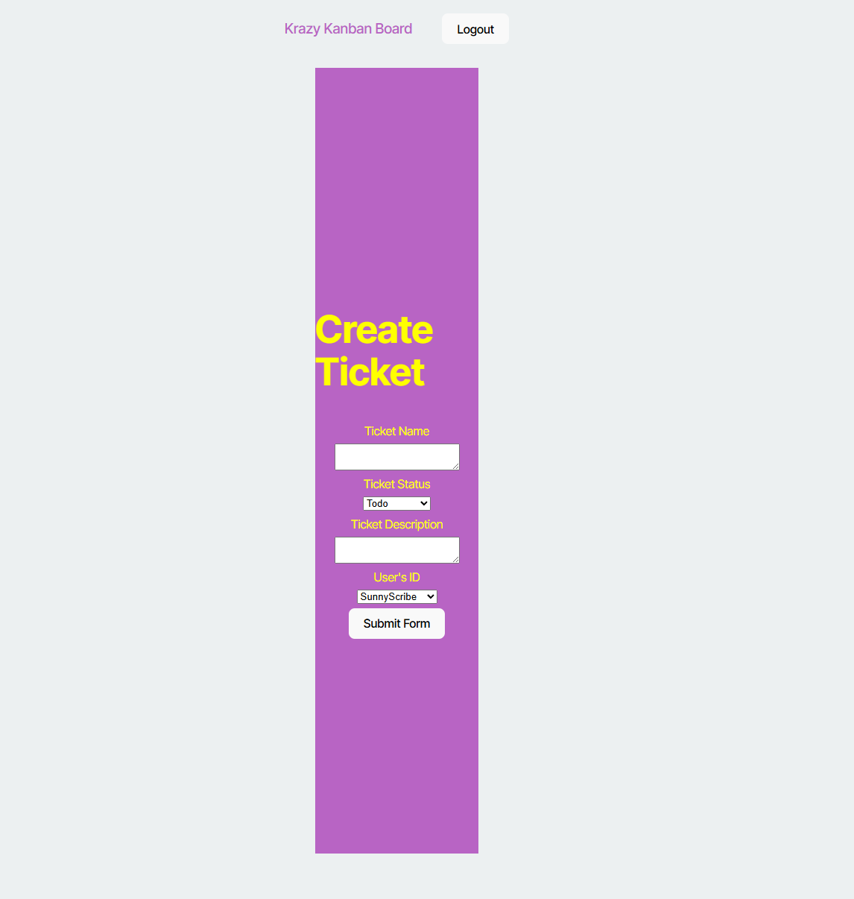

# MadKrayzKaban
Madkrayz Kanban Board

## Basic Overview

The Madkrayz Kanban Board is a Kanban Board with a JWT authentication to the server API. The user will start at the login pagin, and requires the user to login.
Once user logged in, the user can view, create or delete tickets on their account. 

## The Application

The application was deployed on Render to host the application. The application was created using the following tools: 

    React with PostgreSQL
    type: TypeScript
    Deployment: Render

## Deployment

The application was deployed to Render.com.

[Link here](https://git-cand-finder.onrender.com)

    
## Screenshot
The following images demonstrates the application's appearance:

Home Page

Login

tickets

create tickets

© 2024 lenworth425 Confidential and Proprietary. All Rights Reserved.